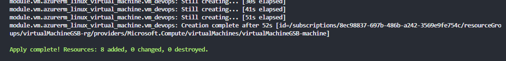

# AzureVM - Modular - Terraform

## Descripción
Este repositorio contiene archivos de terraform capaces de crear una maquina virtual Linux de Ubuntu, este código esta modularizado según diferentes folders.Terraform es una herramienta de código abierto de HashiCorp que permite definir y aprovisionar infraestructura como código.

## Pre-Requisitos
Antes de comenzar, asegurate de tener terraform instalado
<div style="text-align: left">
    <p>
        <a href="https://www.terraform.io/downloads.html" target="_blank"> </a>
    </p>
</div>

Asegurate de tener:

- [Terraform](https://www.terraform.io/downloads.html) instalado en tu maquina local.
- Azure CLI instaldo y configurado con las credenciales

## Versionamiento

Este proyecto esta siendo versionado mediante Git y Github

<div style="text-align: left">
    <a href="https://git-scm.com/" target="_blank"> </a>
    <a href="https://github.com/" target="_blank"> </a>
</div>

## ¿Como empezar?

### Paso 1
Debemos de crear una carpeta que contenga los siguientes archivos
- main.tf (Contendra nuestro codigo fuente para crear las instancias en Azure)
- variables.tf (Definiremos las variables que vamos a utilizar)
- terraform.tfvars (Le damos los valores a las variables creadas en el archivo variables.tf)
- outputs.tf (Al crear una instancia definimos la salidad que deseamos ver)
- providers.tf (En este archivo estará la definición de nuestro provider)
- Luego creamos una subcarpeta llamada modules
- Dentro de la carpeta modules emepezamos a definir las instancias que deseamos crear, cada instancia debe ser un folder
- En cada folder creado anteriormente, debemos de crear los archivos main.tf, variables.tf, outputs.tf.

Una vez hecho esto, nos quedaría una estructura de archivos como esta:


### Paso 2 
Ahora bien, vamos a definir las variables utilizadas en este projecto, esto se hará en el documento variables.tf
```terraform
variable name_function{
    type = string
    description = "Virtual machine name"
}

variable location{
    type = string
    default = "West Europe"
    description = "Location"
}

variable username {
    type = string
    description = "Username"
}
```

### Paso 3
Una vez definidas las variables, le vamos a dar valores a estas, lo hacemos en el archivo terraform.tfvars
```terraform
name_function = "virtualMachineGSB"
location = "East US"
username = "usernamegsb"
```

### Paso 4
Definimos el provider en nuestro archivo providers.tf
```terraform
# Se define el provider que se va a usar, en este caso Azure
provider "azurerm" {
    features{}
}
```

### Paso 5
Definimos las instancias de Azure que necesitaremos para crear la Virtual Machine (Para información mas detallada de las instancias creadas ir al siguiente repositorio, [click aqui](https://github.com/GabrielSB19/VM-Terraform)).
- Nuestro folder que contiene la maquina virtual quedaría de la siguiente manera
```terraform
resource "azurerm_public_ip" "devops_ip" {
    name                = "${var.name_function}-public-ip"
    location            = var.location
    resource_group_name = var.resource_group_name
    allocation_method   = "Static"
}

resource "azurerm_network_interface" "devops_nic" {
    name                = "${var.name_function}-nic"
    location            = var.location
    resource_group_name = var.resource_group_name

    ip_configuration {
    name                          = "internal"
    subnet_id                     = var.subnet_id
    private_ip_address_allocation = "Dynamic"
    public_ip_address_id          = azurerm_public_ip.devops_ip.id
    }
}

resource "azurerm_network_security_group" "devops_sg" {
    name                = "${var.name_function}-sg"
    location            = var.location
    resource_group_name = var.resource_group_name


    security_rule {
        name = "test123SSH"
        priority = "100"
        direction = "Inbound"
        access = "Allow"
        protocol = "Tcp"
        source_port_range = "*"
        destination_port_range = "22"
        source_address_prefix  = "*"
        destination_address_prefix = "*"
    }

    security_rule{
        name = "PING"
        priority = "1000"
        direction = "Inbound"
        access = "Allow"
        protocol = "Icmp"
        source_port_range = "*"
        destination_port_range = "*"
        source_address_prefix = "*"
        destination_address_prefix = "*"
    }

    tags = {
        environment = "Production"
    }
}

resource "azurerm_network_interface_security_group_association" "devops_association" {
    network_interface_id      = azurerm_network_interface.devops_nic.id
    network_security_group_id = azurerm_network_security_group.devops_sg.id
}

resource "azurerm_linux_virtual_machine" "vm_devops" {
    name = "${var.name_function}-machine"
    resource_group_name = var.resource_group_name
    location = var.location
    size = "Standard_F2"
    admin_username = var.user
    network_interface_ids = [azurerm_network_interface.devops_nic.id]

   admin_ssh_key {
        username = var.user
        public_key = file("C:/Users/semillero/id_rsa.pub")
    }

    os_disk {
        caching = "ReadWrite"
        storage_account_type = "Standard_LRS"
    }

    source_image_reference {
        publisher = "Canonical"
        offer = "0001-com-ubuntu-server-focal"
        sku = "20_04-lts"
        version = "latest"
    }
}
```
- su respectivo archivo variables.tf sería el siguiente
```terraform
variable "resource_group_name" {
    type = string
    description = "grupo de recursos de las vm"
}

variable "location" {
    type = string
    description = "region"
}

variable "subnet_id" {
    type = string
    description = "id de la subnet de los servidores"
}

variable "user" {
    type = string
    description = "usuario ssh"
}

variable "name_function" {
    type = string
    description = "prefijo de los recursos"
}
```
- Ahora creamos nuestro main.tf donde llamaremos a los modulos
```terraform
resource "azurerm_resource_group" "main" {
    name     = "${var.name_function}-rg"
    location = var.location
}

resource "azurerm_virtual_network" "main" {
    name                = "${var.name_function}-network"
    location            = azurerm_resource_group.main.location
    resource_group_name = azurerm_resource_group.main.name
    address_space       = ["10.0.0.0/16"]
}

resource "azurerm_subnet" "main" {
    name                 = "${var.name_function}-subnet"
    resource_group_name  = azurerm_resource_group.main.name
    virtual_network_name = azurerm_virtual_network.main.name
    address_prefixes     = ["10.0.1.0/24"]
}

module "vm" {
    source = "./modules/vm"
    resource_group_name = azurerm_resource_group.main.name
    location = azurerm_resource_group.main.location
    subnet_id = azurerm_subnet.main.id
    name_function = var.name_function
    user = var.username
}
```

## Comandos de Terraform
Una vez tenemos el codigo listo, debemos de montar nuestras maquinas a la nube, para lograr esto debemos de utilizar los siguientes comandos
- terraform init (Descargar los providers)

- terraform validate (Valida la sintaxis de nuestro codigo de terraform)

- terraform plan (Muestra los cambios que se aplicaran)


- terraform apply (Aplica los cambios del codigo de terraform, crea las instancias)

- terraform destroy (En caso de querer borrar todo el grupo de recursos)

## Evidencia
Ahora vamos a ver nuestra Azure Portal para ver si la maquina se creo correctamente
- Empezaremos mirando el grupo de recursos

- Continuaremos con la maquina virtual

- Ahora los detalles de la VM


Ahora finalmente tenemos nuestra maquina montada en Azure


